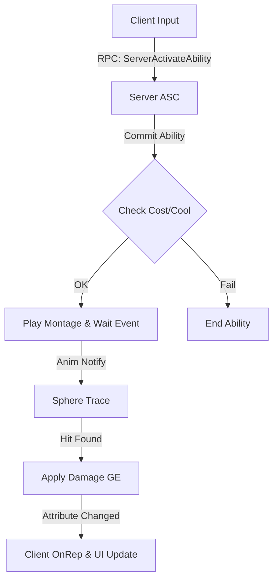

# Project JA (Action RPG)

> # 제작중입니다

> **Dedicated Server** 기반의 고도화된 **Gameplay Ability System (GAS)** 설계 및 실무 프레임워크 구축 프로젝트<br>
> **Hybrid C++ Architecture**를 통한 성능 최적화와 네트워크 무결성 확보 지향<br>
> 엔진 버전: **Unreal Engine 5.5.4**

---

## 목차 (Table of Contents)
1. [Overview](#1-overview)
2. [Focus & Goals](#2-focus--goals)
3. [Technical Stack](#3-technical-stack)
4. [Game Preview](#4-game-preview)
5. [Key Features](#5-key-features)
6. [Core Implementation](#6-core-implementation)
7. [Troubleshooting](#7-troubleshooting)
8. [Project Structure](#8-project-structure)
9. [Architecture](#9-architecture)
10. [Repository Info](#10-repository-info)
11. [License / Usage](#11-license--usage)
12. [Author](#12-author)

---

## 1. Overview

**Project JA**는 단순 기능 구현을 넘어, 대규모 액션 RPG의 코어 시스템을 **Dedicated Server** 환경에서 설계하고 검증하는 엔지니어링 중심 포트폴리오입니다.

강의의 베이스라인을 기반으로 하되, 핵심 로직을 **BP -> C++로 리팩토링**하고 **네트워크 예측(Prediction)** 및 **동기화 로직**을 직접 구현하여 실무 수준의 아키텍처 역량을 증명합니다.

---

## 2. Focus & Goals

* **Server-Authoritative GAS 설계**
  * Dedicated Server 환경에서 Ability, Effect, Attribute의 무결성 보장 및 **GAS Prediction**을 통한 레이턴시 보정

* **Hybrid C++ 리팩토링 및 최적화**
  * 블루프린트 로직의 C++ 이식을 통한 유지보수성 향상 및 **Data-Driven(DataTable/DataAsset)** 설계 패턴 확립

* **심화 시스템 통합 및 확장**
  * **Custom Climbing(CharacterMovement 확장)**, **MVVM UI**, **멀티플레이어 동기화** 등 복합 시스템의 유기적 통합

---

## 3. Technical Stack

| 항목 | 내용 |
| :--- | :--- |
| **Engine** | Unreal Engine 5.5.4 |
| **Language** | C++17 (Core Logic), Blueprint (Content Only) |
| **Network** | Dedicated Server, RPCs, Replication, Prediction Key |
| **Core Systems** | Gameplay Ability System (GAS), MVVM (UI), Enhanced Input |
| **Movement** | Custom CharacterMovement (Climbing), Motion Warping |
| **Profiling** | Unreal Insights, HISM (Optimization) |

---

## 4. Game Preview

> *현재 개발 단계의 인게임 스크린샷 및 영상 링크입니다.*


---

## 5. key features

* **Combat System**
  * 4타 콤보 공격 및 역경직(Hit Stop) 타격감 구현
  * 정교한 패링(Parrying) 및 퍼펙트 회피 시스템

---

## 6. Core Implementation

### 6.1. Data-Driven Skill Architecture
* **설명:** 하드코딩을 배제하고 `UDataAsset`과 `DataTable`을 활용해 스킬 데이터(계수, 쿨타임, 몽타주)를 관리하도록 설계
* **구현:** `GameplayAbility` 클래스를 상속받아 `UGA_SkillBase`를 제작하고, `FGameplayTag`로 로직 분기 처리
* **성과:** 기획 데이터 수정만으로 컴파일 없이 스킬 밸런싱 가능 구조 확립

### 6.2. Custom Character Movement (Climbing)
* **설명:** 기본 `CharacterMovementComponent`의 한계를 넘어 벽 타기(Climbing) 로직 구현
* **구현:** `FSavedMove_Character`와 `PerformMovement`를 오버라이딩하여 서버-클라이언트 간 이동 동기화 처리 (Prediction 적용)
* **성과:** 네트워크 지연 상황에서도 끊김 없는 벽 타기 모션 동기화 성공

---

## 7. Troubleshooting

### 7.1. GAS Attribute Replication 순서 문제
* **문제 상황:** 클라이언트에서 리스폰 시 HP UI가 0으로 표기되었다가 뒤늦게 갱신되는 글리치 발생
* **원인 분석:** `OnRep_Health` 호출 시점과 UI 위젯의 `Init` 시점 간의 레이스 컨디션 (Race Condition)
* **해결 방법:** `ASC(AbilitySystemComponent)`의 `GetGameplayAttributeValueChangeDelegate`를 활용하여, 값이 변경되는 순간에만 확실하게 UI에 브로드캐스팅하도록 **Observer Pattern** 적용
* **결과:** 리스폰 및 초기화 시점의 UI 데이터 불일치 완벽 해결

---

## 8. Project Structure

```text
ProjectJA
 ├── Source
 │   ├── ProjectJA
 │   │   ├── Public / Private
 │   │   │   ├── Character   # Hero, Enemy, Controllers
 │   │   │   ├── GAS         # GA, GE, Attributes, Tasks
 │   │   │   ├── System      # GameMode, GameInstance, AssetManager
 │   │   │   ├── UI          # MVVM ViewModels, Widgets
 │   │   │   └── Input       # Enhanced Input Configs
 ├── Content
 │   ├── Blueprints
 │   ├── Maps
 │   └── UI
```

---

## 9. Architecture

### Core Workflow : Attack Validation Flow
> *Server-Client 간의 공격 판정 및 데미지 적용 흐름*



---

## 10. Repository Info

이 저장소는 **C++ 아키텍처 설계 및 네트워크 동기화 로직 기록용**입니다.
프로젝트의 핵심 클래스와 엔지니어링 의사결정 과정을 공개하며, 대용량 에셋 및 빌드 산출물은 포함되지 않습니다.

---

## 11. License / Usage

* **License:** MIT License (Code only)
* **Reference:** 
  * [Udemy – Unreal Engine 5 C++ Advanced Action RPG](https://www.udemy.com/course/unreal-engine-5-advanced-action-rpg-korean/)
  * [Udemy – Unreal Engine 5 C++: 클라이밍 시스템 구축하기](https://www.udemy.com/course/unreal-engine-5-cpp-climbing-system-korean)
  * [Udemy – Unreal Engine 5 C++: Advanced Frontend UI Programming](https://www.udemy.com/course/ureal-engine-5-cpp-advanced-frontend-ui-programming/)


* **Assets:**
  * 배경 리소스
  * Dwarven City Modular Environment – Scale Z (ArtStation / Fab)

  * 애니메이션
  * Bossy Enemy Animation Pack – kampinis (Epic Games Fab)
  * Paragon Character Assets – Epic Games
  * Mixamo - Adobe
  * Unreal Engine Starter Content

  * VFX 및 사운드
  * Human Vocalizations – Gamemaster Audio (Epic Games Fab)
  * Realistic Sword Sound Effects – Modern Monkey Studios (Epic Games Fab)
  * Unreal Engine Starter Content

---

## 12. Author

**Lim Jaehyeok (임재혁)** Game Client Developer
* Email: jehyuk1711@gmail.com
