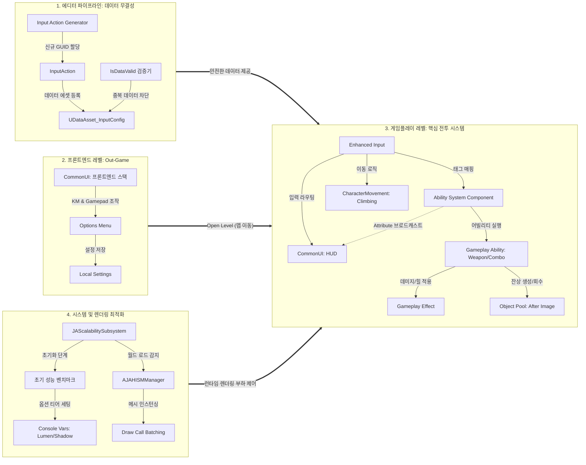

<div id="top"></div>

# Project JA (Action RPG)

> **Gameplay Ability System** 싱글 플레이어 액션 RPG 프로젝트<br>
> **렌더링 최적화**, **에디터 파이프라인 자동화**<br>
> 엔진 버전: **Unreal Engine 5.5**

---

## 목차
1. [개요](#1-개요)
2. [핵심 목표 및 중점 사항](#2-핵심-목표-및-중점-사항)
3. [기술 스택](#3-기술-스택)
4. [게임 미리보기](#4-게임-미리보기)
5. [핵심 구현 사항](#5-핵심-구현-사항)
6. [트러블슈팅](#6-트러블슈팅)
7. [프로젝트 구조](#7-프로젝트-구조)
8. [시스템 아키텍쳐](#8-시스템-아키텍쳐)
9. [레포지토리 정보](#9-레포지토리-정보)
10. [레퍼런스 및 리소스](#10-레퍼런스-및-리소스)
11. [작성자](#11-작성자)

---

## 1. 개요

**Project JA**는 언리얼 엔진 5의 Game Ability System을 활용해 액션 전투를 구현한 개인 프로젝트입니다.  
GAS의 구조를 파악한 뒤 응용하여 독자적인 어빌리티 로직을 확장하여 개발했습니다.  
렌더링 병목 현상을 최적화하고, 에셋 검증 및 생성 자동화 툴까지 직접 구축하며 클라이언트 시스템 전반의 개발 사이클을 완성하는 데 집중했습니다.

---

## 2. 핵심 목표 및 중점 사항

* **시스템 성능 최적화**
  - 초기 벤치마킹 기반의 능동적 Scalability Subsystem 구축 및 HISM(Hierarchical Instanced Static Mesh) 자동 배칭을 통한 Draw Call 절감.

* **에디터 파이프라인 및 데이터 무결성**
   - 에셋 복제로 인한 GUID 충돌 버그를 해결하기 위해 C++ AssetTools 기반의 자동화 툴 및 IsDataValid 정적 검증 시스템 구축.

* **데이터 기반 GAS 아키텍처**
   - 하드코딩을 배제하고 UDataAsset과 FGameplayTag를 활용한 콤보, 스킬, 무기 스왑 로직의 데이터화.

---

## 3. 기술 스택

| 항목 | 내용 |
| :--- | :--- |
| **엔진** | Unreal Engine 5.5 |
| **언어** | C++(Core Logic), Blueprint(Contents) |
| **최적화** | HISM Manager, Unreal Insights, Custom GameInstanceSubsystem |
| **시스템** | Gameplay Ability System (GAS), CommonUI, Enhanced Input, AI (BT, EQS) |
| **이동** | Custom CharacterMovement (Climbing), Motion Warping |
| **에디터** | AssetTools, DataValidation, Editor Utility Widget |

---

## 4. 게임 미리보기

* [기술 구현 상세 및 핵심 기능 설명](https://youtu.be/FuPVmhB996s) (5m 12s)
* [인게임 플레이 (Full ver.)](https://youtu.be/6-geVG32l0c) (6m 10s)

---

## 5. 핵심 구현 사항

### 5.1. Dynamic Scalability & HISM 렌더링 최적화
<details>
<summary><b>상세 내용 보기 (클릭)</b></summary>
  
* **설명:** 과도한 프롭 배치 및 동적 라이트로 인한 GPU, Draw Thread 병목 해소.
* **구현:** 게임 진입 시 2초간의 Warmup 후 5초간 프레임을 측정하여 그림자, 루멘 티어를 결정하는 UJAScalabilitySubsystem 구현. 반복 객체에 대해 메시 스케일 기반 컬링 거리를 계산하는 AJAHISMManager 연동.
* **성과:** **드로우콜 약 71% 감소. 프레임, GPU 연산 소요시간 약 54% 감소.**

</details>

### 5.2. 에셋 파이프라인 자동화 (Input Action 에셋 제너레이터 제작)
<details>
<summary><b>상세 내용 보기 (클릭)</b></summary>

* **설명:** 무기 교체 시 내부 GUID 충돌로 인해 입력 이벤트가 중복 호출되는 엔진 직렬화 이슈 해결.
* **구현:** IsDataValid를 오버라이드하여 데이터 에셋 저장 시 포인터 및 태그 중복을 검사하는 1차 방어선 구축. 이후 C++ AssetTools 모듈과 UI를 결합하여 에셋 생성 및 등록을 자동화하는 제너레이터 툴 제작.
* **성과:** 휴먼 에러로 인한 **데이터 오염 원천 차단** 및 에셋 파이프라인 생산성 향상.

</details>

### 5.3. 메모리 관리 및 오브젝트 풀링 시스템
<details>
<summary><b>상세 내용 보기 (클릭)</b></summary>
  
* **설명:** 빈번하게 생성, 소멸하는 이펙트 및 회피 잔상으로 인한 GC 스파이크 및 메모리 파편화 방지.
* **구현:** 잔상 메시 컴포넌트를 미리 생성해두고 활성, 비활성화 상태만 토글하는 오브젝트 풀링 시스템 구축.
* **성과:** 런타임 중 무의미한 액터 스폰 연산을 제거하여 전투 중 프레임 방어 및 **메모리 안정성 확보.**

</details>

### 5.4. 데이터 기반 GAS 및 전투 시스템
<details>
<summary><b>상세 내용 보기 (클릭)</b></summary>
  
* **설명:** 기획 데이터 수정만으로 컴파일 없이 밸런싱이 가능한 구조 확립.
* **구현:** GameplayAbility를 상속받은 커스텀 베이스 클래스와 UDataAsset, DataTable을 활용하여 총기 및 카타나 근접 콤보, 패링 로직 분기 처리.

</details>

---

## 6. 트러블슈팅

### 6.1. Merge Actor 한계 파악 및 HISM 하이브리드 배치
<details>
<summary><b>상세 내용 보기 (클릭)</b></summary>
  
* **문제 상황:** 최적화를 위해 다수의 환경 프롭을 Merge Actor로 정적 병합하였으나, 바운딩 박스가 거대해져 오클루전 컬링이 무력화되고 GPU 연산 부하가 증가함.
* **해결 방법:** 유니크한 배경 구조물은 Merge Actor를 유지하되, 반복되는 프롭은 런타임에 메시를 추출하여 HISM으로 인스턴싱하는 시스템 개발.
* **결과:** 오클루전 컬링 활용 및 Draw Call 극대화.

</details>

### 6.2. 에셋 직렬화 오염으로 인한 다중 입력 라우팅 이슈 (GUID 충돌)
<details>
<summary><b>상세 내용 보기 (클릭)</b></summary>

* **문제 상황:** 1번 무기 장착 키 입력 시 1번과 2번 장착 어빌리티가 동시 호출되는 현상 발생.
* **분석 및 해결:** 에셋 수동 복제 시 GUID가 갱신되지 않아 쿠킹 환경에서 내부 바인딩 테이블 맵 충돌이 발생함을 디버깅 로그로 입증. 위 [5.2]의 **자동화 툴과 검증 로직 도입**을 통해 아키텍처 수준에서 재발 방지.

</details>

---

## 7. 프로젝트 구조

```text
ProjectJA
 ├── Source
 │   ├── ProjectJA
 │   │   ├── Public / Private
 │   │   │   ├── Character   # Hero, Enemy, Controllers
 │   │   │   ├── GAS         # GA, GE, Attributes, Tasks
 │   │   │   ├── System      # Scalability Subsystem, Instance, AssetManager
 │   │   │   ├── Optimization# HISM Manager
 │   │   │   ├── UI          # CommonUI, Widgets
 │   │   │   └── JAEditor    # Editor Pipeline Tools, Validation
 ├── Content
 │   ├── Blueprints
 │   ├── Maps
 │   └── UI
```

---

## 8. 시스템 아키텍쳐

### 핵심 시스템 아키텍쳐
> *전체 라이프사이클 구조도 (데이터 파이프라인, 프론트엔드 UI, 코어 전투, 렌더링 최적화)*




---

## 9. 레포지토리 정보

이 저장소는 **클라이언트 아키텍처 설계 및 최적화 로직 기록용**입니다.
프로젝트의 핵심 클래스와 엔지니어링 구현 과정을 공개하며, 대용량 에셋 및 빌드 산출물은 포함되지 않습니다.

---

## 10. 레퍼런스 및 리소스

* **Reference:** 
  * [Udemy – Unreal Engine 5 C++ Advanced Action RPG](https://www.udemy.com/course/unreal-engine-5-advanced-action-rpg-korean/)
  * [Udemy – Unreal Engine 5 C++: 클라이밍 시스템 구축하기](https://www.udemy.com/course/unreal-engine-5-cpp-climbing-system-korean)
  * [Udemy – Unreal Engine 5 C++: Advanced Frontend UI Programming](https://www.udemy.com/course/ureal-engine-5-cpp-advanced-frontend-ui-programming/)


* **Assets:**
  * **배경 리소스**
    * Dwarven City Modular Environment – Scale Z (ArtStation / Fab)

  * **애니메이션**
    * Paragon Character Assets – Epic Games
    * Mixamo - Adobe
    * Unreal Engine Starter Content

  * **VFX 및 사운드**
    * Human Vocalizations – Gamemaster Audio (Epic Games Fab)
    * Realistic Sword Sound Effects – Modern Monkey Studios (Epic Games Fab)
    * Unreal Engine Starter Content
   
  * **로고 및 영상**
    * AI Assisted Design – Gemini (Google)

---

## 11. 작성자

**Lim Jaehyeok (임재혁)** Game Client Developer
* Email: jehyuk1711@gmail.com

[▲ 맨 위로 가기](#top)
